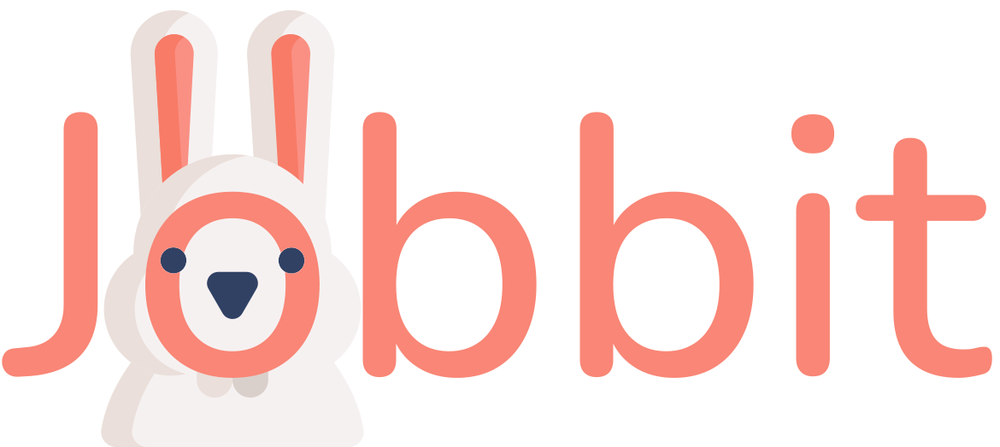

# 
Jobbit Project

## 
Job Platform for Individuals, HRs, Recruiters, Agencies and Companies

### Mission:
Today we are faced with a situation where companies can not find employees who meet their requirements.
The main goal of **Jobbit** is to provide companies employees with high qualifications, knowledge, relevant experience and with salaries corresponding to the international market.

From the point of view of employees, we offer interesting, competitive, professional growth work.

**Jobbit** also has access to HRs, Talent Acquisition Specialists, Recruiters և HR / Recruitment agencies.

We offer HR / Recruiter / Talent Acquisition Specialists to promote job postings on the platform, find highly qualified staff, and earn money for it.

HR companies will have the opportunity to place announcements of their partner companies, as well as promote other announcements on the platform.

### Features:

- All premium features 3 months free-trial

#### For companies:
* Authentication
    * Multi-user authentication
    * Social authentication
    * Dashboard
* Jobs
    * Post a job
    * Edit job
* Campaigns
    * Create campaign
    * Edit campaign
* Stats
    * By jobs views/applies/shortlist/hire/reject
* Packages
    * Subscribe to package
    * Upgrade package
    * Auto Extend Package
* Billing
* Settings

#### For candidates:

#### For HR/Recruiter/Talent Acquisition Specialists:

#### For HR agencies:
